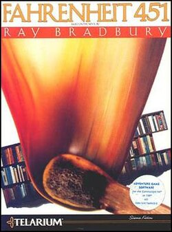

# Fahrenheit 451 - Interactive fiction game

A modern terminal recreation of the classic MS-DOS Interactive fiction game "Fahrenheit 451" by Telarium (1984), based on the novel by Ray Bradbury.



## About This Project

This project is a complete **Python** rewrite of the original Telarium adventure game, bringing Fahrenheit 451 to modern terminals. The original game files were analyzed and their data extracted to build a new engine that preserves the original game's spirit while running natively on today's systems.

**Built with Python** - A modern, clean implementation of the classic text adventure engine.

**Fully translated** - Available in both **English** and **Spanish** (Español) with a language selection menu at startup.

## Installation

```bash
pip install -e .
```

## Running the Game

```bash
fahrenheit-451
```

Or directly with Python:

```bash
python src/main.py
```

## Requirements

- Python 3.8+
- rich (for enhanced terminal display)

## Language Selection

The game starts with a language selection menu:
- Press `1` for **English**
- Press `2` for **Español**

## Controls

### English Commands
- `LOOK` or `L` - Examine your surroundings
- `GO <direction>` or just `NORTH/SOUTH/EAST/WEST` - Move
- `N, S, E, W` - Quick movement
- `EXAMINE <object>` - Look at something closely
- `TAKE <object>` - Pick up an object
- `DROP <object>` - Put down an object
- `INVENTORY` or `I` - See what you're carrying
- `SAY "text"` - Speak to someone
- `USE <object>` - Use an object
- `SAVE` - Save your game
- `LOAD` - Load saved game
- `RESTART` - Start over
- `QUIT` - Exit the game
- `HELP` - Show help

### Comandos en Español
- `MIRAR` o `M` - Examinar tu entorno
- `IR <dirección>` o `NORTE/SUR/ESTE/OESTE` - Moverse
- `N, S, E, O` - Movimiento rápido
- `EXAMINAR <objeto>` - Mirar algo de cerca
- `TOMAR <objeto>` - Coger un objeto
- `SOLTAR <objeto>` - Dejar un objeto
- `INVENTARIO` o `I` - Ver qué llevas
- `DECIR "texto"` - Hablar con alguien
- `USAR <objeto>` - Usar un objeto
- `GUARDAR` - Guardar partida
- `CARGAR` - Cargar partida guardada
- `REINICIAR` - Empezar de nuevo
- `SALIR` - Salir del juego
- `AYUDA` - Mostrar ayuda

## Game Overview

You are a firefighter in a dystopian future where books are burned. Based on Ray Bradbury's classic novel, you must navigate this oppressive world, make choices, and find your way to either escape or face the consequences.

## Project Structure

```
fahrenheit-451/
├── src/
│   ├── engine/          # Game engine
│   │   ├── engine.py    # Main game engine
│   │   ├── parser.py   # Command parser
│   │   ├── rooms.py    # Room management
│   │   ├── inventory.py # Inventory system
│   │   └── state.py     # Game state
│   ├── ui/             # Terminal UI
│   │   └── terminal.py
│   ├── i18n/           # Internationalization
│   │   ├── en.json     # English translations
│   │   └── es.json     # Spanish translations
│   └── data/           # Extracted game data
├── scripts/            # Data extraction scripts
└── tests/              # Test files
```

